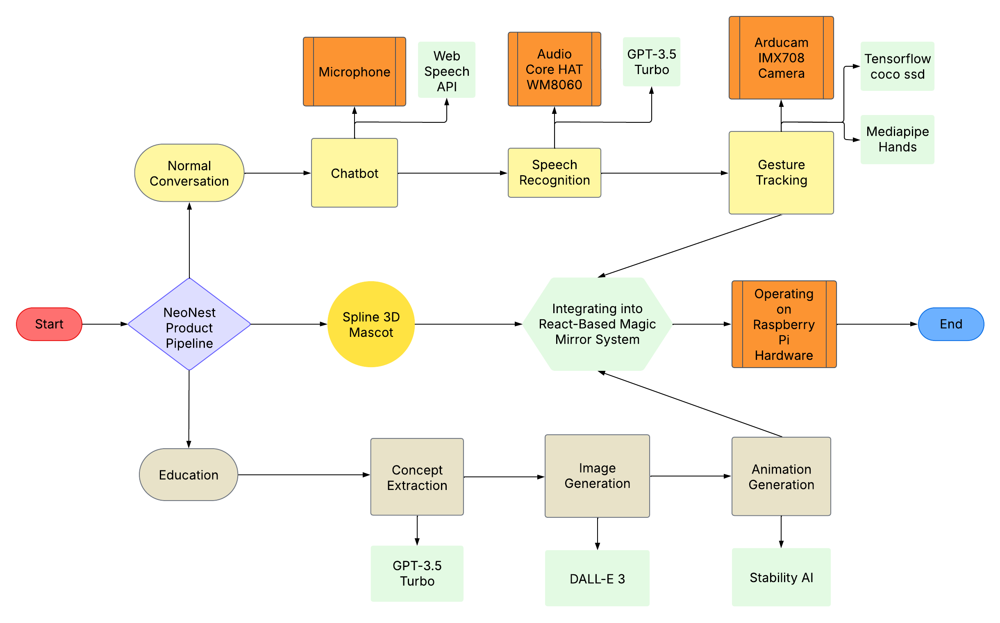

# **NeoNest: The Magic Mirror That Brings Learning to Life**  


[📄 Read the Full Documentation](./NEONEST.pdf)

## Awards

*2025 LIVE AI Ivy Plus Duke & Harvard Hackathon*

🏅 Global Entry Awards:
🥇 1st Global Grand Prize (Gold)
🥇 AI & ML 1st Place
🏆 Best Development
🏆 Best Product

🏅 Duke Campus Entry Awards:
🥇 Gold Prize
🥇 AI/ML 1st Place
🏆 Best Product Design
🏆 Best Product Demo

## **Inspiration**  
We set out to create a **transformative learning experience** for children that **combines education, interactivity, and AI-powered immersion**. Kids naturally engage with **friendly, playful companions**, so we asked ourselves—**what if an AI-powered buddy could not only talk, wave, and follow their movements but also create real-time animated explanations of any topic they want to learn?**  

With NeoNest, we **redefined interactive learning** by blending an **AI-driven chatbot, real-time text guidance, and AI-generated educational animations** into a **magic mirror** that makes learning **fun, engaging, and visually captivating**. Our goal was to **go beyond traditional learning tools** and create an **intelligent companion** that sparks curiosity, enhances comprehension, and encourages interactive exploration.  

## Overiview of NeoNest 


**NeoNest** is an **AI-powered interactive learning companion** that transforms education into an **engaging, immersive experience** for children. This **cutting-edge magic mirror** features a **3D animated chicken chatbot** called "Neo", that interacts in real time—**tracking children’s movements, waving back, and engaging in fun, educational conversations**. But **NeoNest** takes learning even further. As Neo **explains concepts**, the **right half of the mirror dynamically generates real-time animated visualizations**, turning **abstract ideas into tangible, vibrant visuals**. Imagine a **glowing Earth spinning** as Neo **describes the solar system**! And right beside it, **NeoNest displays interactive pop-up text**—**highlighting key words and guiding kids to say them aloud**—reinforcing **reading, comprehension, and retention** in a **playful way**.  

Designed for **homes, classrooms, and learning on the go**, **NeoNest fosters curiosity, attention retention, and an engaging learning experience**. The **AI-driven system** extracts **key topics**, generates **explanations**, and creates **real-time animations**, making education both **interactive and visually captivating**. It is currently available as **both a web app and a physical Magic Mirror version**!

**NeoNest** is not just a **learning tool**—it’s a **revolutionary AI-powered mentor and companion**, blending **conversation, animation, and interactive text** to make learning truly **unforgettable**. With its **portable, intuitive design**, **NeoNest** is the **future of smart, interactive education**. 

## **End-to-End Model Pipeline (Software & Hardware Integration)**



## **What It Does**  
NeoNest is a **revolutionary AI-powered magic mirror** that features:  
- A **3D animated chicken chatbot** that talks, waves, and follows kids’ movements.  
- **Conversational AI** powered by GPT-3.5 Turbo for dynamic, real-time discussions.  
- **Speech recognition and gesture tracking**, enabling natural and responsive interactions.  
- **Interactive text guidance**, displaying **pop-up text** to reinforce reading and pronunciation.  
- **Real-time educational animations**, visualizing learning concepts **as kids explore them**.  
- **Portable design**, allowing NeoNest to be used in classrooms, at home, or on the go. It is currently available as **both a web app and a physical Magic Mirror version**!

### Product Features  

#### 1. AI-Powered Chatbot  
- **3D Animated Chicken Character**: Talks, moves its mouth, and waves interactively.  
- **Speech Recognition & Synthesis**: Powered by Web Speech API for fluid conversations.  
- **Movement Tracking**: Uses TensorFlow Coco-SSD for direction tracking and Mediapipe Hands for gesture recognition.  

#### 2. Real-Time AI-Generated Visuals  
- **Concept Extraction**: Identifies key learning topics from chatbot conversations.  
- **AI-Generated Illustrations**: Uses DALL-E 3 for text-to-image conversion.  
- **Live Animations**: Converts images into dynamic animations via Stability AI.  

#### 3. Interactive Learning Interface  
- **Magic Mirror Display**: LCD display with high responsiveness.  
- **Textual Reference Panel**: Displays chatbot conversation text for context.  
- **Portable Design**: Can be used anywhere, from classrooms to home settings.

## **How We Built It**    

### Technical Implementation  

#### **Software Stack**  
- **React Web App**: Frontend UI framework.  
- **GPT-3.5 Turbo**: Content generation, entity extraction, chatbot functionality.  
- **DALL-E 3**: Converts extracted text into images.  
- **Stability AI**: Transforms images into animations.  
- **Web Speech API**: Enables text-to-speech and speech recognition.  
- **@tensorflow-models/coco-ssd**: Human movement detection.  
- **@mediapipe/hands**: Hand gesture tracking.


#### **Hardware Components**  
- **LCD Display (Magic Mirror)**: For visual interaction.  
- **Raspberry Pi 4B (RPi)**: Core processing unit.  
- **Arducam IMX708 Camera**: For movement and gesture tracking.  
- **Audio Core HAT WM8060**: High-quality sound output.


### Assembly & Integration  

#### **Hardware Setup**  
1. Connect RPi to the Magic Mirror.  
2. Assemble Arducam and Audio HAT.
3. Enabled video streaming between RPi and compute base 
4. Allowed real-time video streaming between RPi and React Web App 

#### **Software Deployment**  
1. Load the React Web App onto RPi.  
2. Integrate AI models for chatbot interaction and animations.  

#### **Real-Time Data Flow**  
1. Chatbot extracts key concepts.  
2. Generates images/animations.  
3. Displays synchronized visuals on LCD.  

## **Challenges We Faced**  
- **Aligning speech and animations** in real-time required pipeline optimization.  
- **Ensuring a seamless AI-driven experience** for **chatbot interactivity, text display, and animated responses**.  
- **Optimizing real-time rendering** for smooth animations on an embedded system.  
- **Hardware assembly and software-hardware integration** required precision and testing.  

## **Accomplishments We're Proud Of**  
- Successfully developed a **fully functional AI-powered interactive learning mirror**.  
- Designed an **engaging, kid-friendly UI** that **combines text, animations, and chatbot interactions**.  
- Created a **highly responsive real-time learning experience** that adapts to children's interests.  
- Integrated **chatbot functionalities, AI-generated animations, and text & voice interactions seamlessly** into a **real-world hardware system**.  

## **What We Learned**  
- **AI-powered learning is most effective when it is multimodal**—integrating **text, images, animations, and voice guidance**.  
- **Real-time AI processing and visualization require optimized architectures** to maintain seamless interactivity.  
- **Combining software and hardware** for a **highly interactive and portable learning device** is a complex but rewarding challenge.  

## **What’s Next for NeoNest**  
- **Expanding the chatbot’s personality** with multiple AI-driven learning buddies.  
- **Enhancing real-time animations** for even more immersive visual learning.  
- **Adding multilingual support** to make NeoNest accessible to children worldwide.  
- **Mobile Syncing**: Allow parents to track learning progress via an app. 

## Conclusion
NeoNest is just the beginning—we envision a future where **AI-powered, interactive learning mirrors** become **a staple in every home and classroom**, making education more **immersive, engaging, and accessible for children everywhere.** 

## Prerequisites

- Python 3.11+
- OpenAI API key
- AWS account with appropriate credentials
- Stability AI API key
- Required Python packages (see `requirements.txt`)

## Installation

```bash
# Clone the repository
git clone https://github.com/yourusername/LIVE-AI-2025-Hackathon.git
cd LIVE-AI-2025-Hackathon

# Install dependencies
pip install -r requirements.txt
```

## Configuration

Create a `.env` file in the root directory:

```properties
OPENAI_API_KEY=your_openai_api_key
AWS_ACCESS_KEY_ID=your_aws_access_key_id
AWS_SECRET_ACCESS_KEY=your_aws_secret_access_key
AWS_DEFAULT_REGION=us-east-1
STABILITY_AI_API_KEY=your_stability_api_key
```

## Usage

Run the main application:

```bash
python main.py
```

Follow the interactive prompts to:
1. Enter your interest topic
2. Choose a specific aspect to explore
3. View generated images and animations

## Project Structure

```
LIVE-AI-2025-Hackathon/
├── backend/
│   ├── main.py                         # Main application entry point
│   ├── InterestExplorer.py            # OpenAI integration
│   ├── ProcessInterest.py             # Interest processing
│   ├── EducationalAnimationPipeline.py # Animation pipeline
│   ├── text_to_image.py               # AWS Titan integration
│   └── image_to_animation.py          # Animation generation
├── frontend/
│   ├── src/
│   │   ├── components/                 # React components
│   │   ├── services/                   # API services
│   │   └── App.js                     # Main React app
│   └── public/                        # Static assets
├── raspberry_pi/
│   ├── camera_stream.py              # Video streaming
│   ├── udp_connection.py             # UDP signal handling
│   └── hardware_config.py            # Hardware setup
├── config/
│   ├── .env                          # Environment variables
│   └── requirements.txt              # Python dependencies
└── README.md                         # Project documentation
```

## Contributing

1. Fork the repository
2. Create your feature branch (`git checkout -b feature/AmazingFeature`)
3. Commit your changes (`git commit -m 'Add some AmazingFeature'`)
4. Push to the branch (`git push origin feature/AmazingFeature`)
5. Open a Pull Request

## License

This project is licensed under the MIT License - see the LICENSE.md file for details.

## Acknowledgments

- OpenAI for providing the GPT API
- AWS Services for image and animation processing
- Contributors and maintainers of the project

## Addendum

## Hardware

### Demonstration streaming capability


### Enabled raspberry pi to send UDP signals 


### Enabled raspberry pi to stream video capture


### Enabled UDP connection on receiver end


